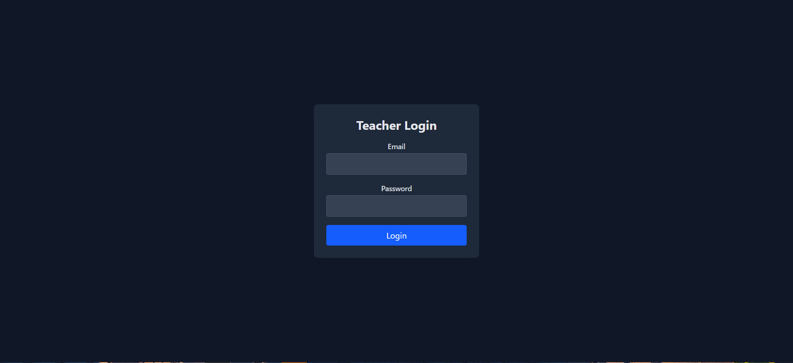
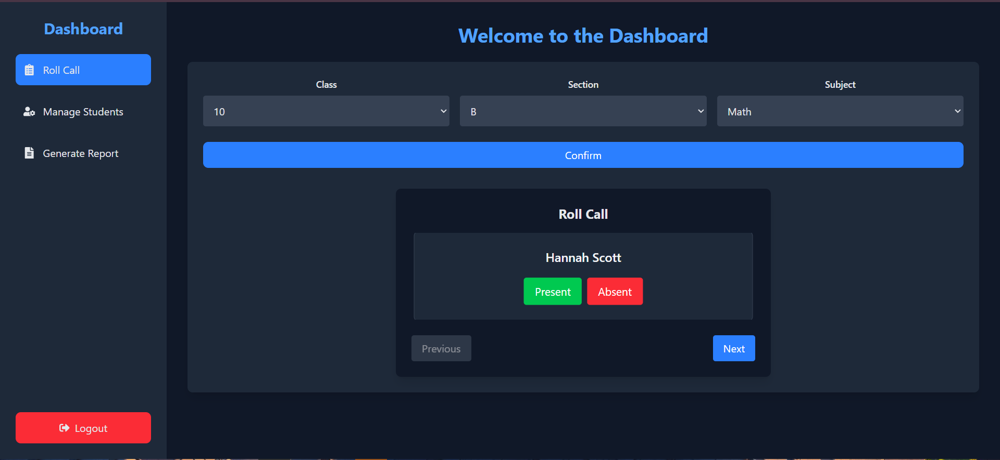
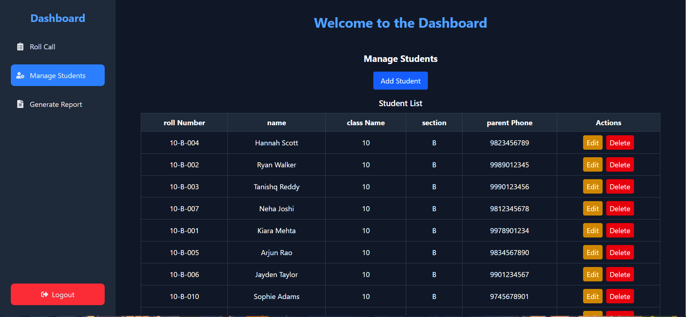
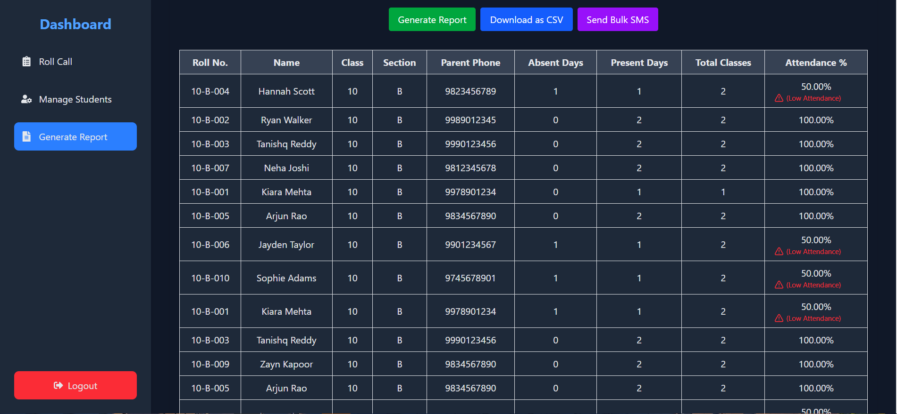

# 📋 MERN Stack Student Attendance Management System

A **Student Attendance Management System** built with the **MERN stack** (MongoDB, Express, React, Node.js) and deployed on **AWS EC2 using Docker**. This project enables efficient attendance tracking, reporting, and management for educational institutions.

**🌐 [Live Demo](http://13.62.67.161/)** — Visit the live version hosted on **AWS EC2**! 🚀

DM me on [Instagram](https://www.instagram.com/dhanaraj_rk_) to get testing purpose credentials

---

## 📸 Screenshots

1. **Login Page**
  
_User-friendly login form with JWT authentication._

---

2. **Student Roll Call Page**
  
_Mark students as present or absent one by one with an easy-to-use interface._

---

3. **Manage Students Page**
  
_Add, edit, and delete students class-wise and section-wise._

---

4. **Attendance Report Page**
  
_View attendance reports with warning signs for low attendance and options to download CSV or send SMS._

---

## ✨ **Features**

1. **🔐 Authenticated JWT Login:**  
   - Secure login for teachers with **JWT authentication**.

2. **📋 Student Roll Call:**  
   - Roll call based on **Class, Section, and Subject**.  
   - Students appear **one by one** with **Present** and **Absent** buttons.

3. **🛠 Manage Students:**  
   - **Add, Edit, and Delete** students based on **Class** and **Section**.

4. **📊 Generate Attendance Report:**  
   - Generate reports for a **specific Class, Section, and Date range**.  
   - Shows a **warning sign** for students with **low attendance**.

5. **📥 Download as CSV:**  
   - Export attendance reports as a **CSV file** for review.

6. **📲 Send Bulk SMS:**  
   - **Send SMS** to parents of students with low attendance.  
   - Supports **bulk SMS** sending directly from the report page.

---

## 🛠 **Tech Stack**

- **Frontend:** React, Tailwind CSS, Zustand  
- **Backend:** Node.js, Express, MongoDB Atlas, JWT, Twilio
- **State Management:** Zustand  
- **Deployment:** AWS EC2, Docker, GitHub Actions  
- **Version Control:** Git & GitHub  

---

## 🛠 **Environment Variables Configuration**

### **For `.env` in the `backend` folder:**
Replace with your own values:
```env
MONGO_URI=your-mongodb-uri
JWT_SECRET=your-jwt-secret
PORT=5000

TWILIO_ACCOUNT_SID=your-twilio-account-sid
TWILIO_AUTH_TOKEN=your-twilio-auth-token
TWILIO_PHONE_NUMBER=your-twilio-phone-number
```

---

### **For `.env` in the `frontend` folder:**
Replace the AWS backend URL with `localhost` for local testing:
```env
VITE_AWS_BACKEND_BASE_URL=http://localhost:5000
```
**Instead of:**
```env
VITE_AWS_BACKEND_BASE_URL=http://16.16.247.128
```

---

## 📦 **Installation**

### **1. Clone the repository**
```bash
git clone https://github.com/dhanarajrk/Student-Attendance-System
cd Student-Attendance-System
```

### **2. Install Dependencies**

**Backend:**
```bash
cd backend
npm install
```

**Frontend:**
```bash
cd client
npm install
```

---

## 🖥 **Run the Project Locally**

- **Backend:** `cd backend` → `node server.js`  
- **Frontend:** `cd client` → `npm run dev`  

---

## ☁️ **AWS EC2 Deployment Summary**

1. **Hosted on:** AWS EC2 using Docker containers.  
2. **Public URL:** [http://16.16.247.128](http://16.16.247.128)  
3. **Deployment Method:** Built and deployed Docker containers directly on the EC2 instance.  

---

## 📚 **API Endpoints**

| Method | Endpoint                       | Description                     |
|--------|--------------------------------|---------------------------------|
| POST   | `/api/students`                | Add a new student               |
| GET    | `/api/students`                | Get all students                |
| PUT    | `/api/students/:id`            | Update a student                |
| DELETE | `/api/students/:id`            | Delete a student                |
| POST   | `/api/attendance/mark`         | Mark attendance                 |
| GET    | `/api/attendance/report`       | Get attendance report           |

---

## 🛡 **Security**

- **Authentication:** JWT for API security.  
- **Environment Variables:** `.env` for secrets and configs.  
- **Firewall:** Security Groups on AWS EC2 for access control.  

---

## 📝 **To-Do**

- [ ] Improve UI/UX for mobile devices. 

---

## 📄 **License**

This project is licensed under the GNU General Public License v3.0.  
You may use, modify, and distribute this software **non-commercially** as long as you provide the source code and retain this license.

---

## 💬 **Feedback**

Feel free to open an issue or submit a pull request if you have any suggestions!

---

**Happy Coding! 🚀**
